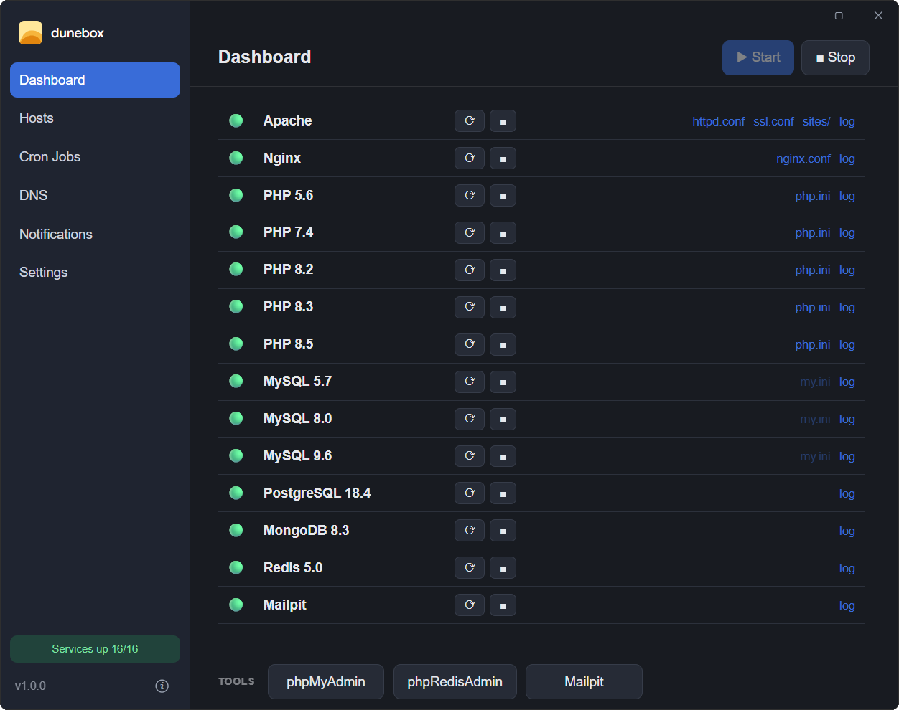

  

  <picture>
    <source media="(prefers-color-scheme: dark)" srcset="dunebox-wordmark.svg">
    
  </picture>

<strong>The complete PHP development environment for Windows.</strong>

Download a zip, extract it wherever you want, open `dunebox.exe`. On first launch a short wizard lets you choose what to install, then Dunebox downloads and configures everything by itself: web server, PHP (up to five versions at once), databases, mail, tools. No installer, no Windows service — when you remove it, just delete the folder.

  <picture>
    
  </picture>

<strong>Freeware</strong> — free to use, built for <strong>Laravel and PHP</strong> developers on Windows.

  <a href="../../releases/latest"><strong>⬇ Download</strong></a> ·
  <a href="https://dunebox.enesi.it/docs.html" target="_blank"><strong>📖 Documentation</strong></a> ·
  <a href="https://dunebox.enesi.it" target="_blank"><strong>🌐 Website</strong></a>

---

## ✨ What you get

- **Every PHP version at once** — 5.6 · 7.4 · 8.2 · 8.3 · 8.5, side by side, no switching
- **Many databases, even the same engine in several versions** — MySQL 9.6 + 8.0 + 5.7 + MariaDB together, each on its own port; PostgreSQL, MongoDB, Redis optional
- **A local domain + green HTTPS for every project** — `mysite.test` in seconds, trusted certificate, Apache or nginx per site
- **A smart terminal** — `php`/`artisan`/`composer` automatically use the project's PHP version
- **Built-in web tools** — phpMyAdmin (manages all MySQL/MariaDB instances), phpRedisAdmin, Mailpit
- **Cron Jobs**, **optional local DNS**, **dev tools** (Git/Node/nvm/Python/FFmpeg via their official channels), bundled **Composer**
- **Claude integration** — drive Dunebox from Claude Code / Claude Desktop
- **Truly portable** — one folder; move it, copy it, carry it on a USB stick

---

## 📥 Get started

1. Download the latest release zip (**`dunebox-vX.Y.Z.zip`**) from the [Releases](../../releases/latest) page.
2. **Extract it** — we recommend **`C:\dunebox`** (any folder, another drive, or a USB stick works). That folder becomes Dunebox's home.
3. Open **`dunebox.exe`** and follow the short setup wizard. Dunebox downloads the selected packages and configures everything, with **one Windows confirmation (UAC)** to add the host entries and trust the local certificate.

Requirements: Windows 10/11 (64-bit), an internet connection on first launch (to download packages), ~2–3 GB of disk for a typical install.

## 🔄 Updating

A new version only replaces the two executables — your **`config\` folder and your databases are left untouched**, so your existing environment keeps working unchanged. Two steps:

1. **Quit Dunebox** from the tray icon (so all services stop), then **make an emergency backup of the two current executables**: copy `dunebox.exe` (in the root) and `system\dunebox-cli.exe` to, e.g., `dunebox.exe.bak` and `system\dunebox-cli.exe.bak`. If anything goes wrong, restore those two files to roll back.
2. Download **`dunebox.exe`** and **`dunebox-cli.exe`** from the [latest release](../../releases/latest) and **overwrite the two files in place** — `dunebox.exe` in the root, `dunebox-cli.exe` inside the `system\` folder. **Do not overwrite the `config\` folder**: keeping your current configuration is what preserves compatibility with your existing environment. Reopen `dunebox.exe`.

## 📖 Documentation

The full guide lives at **[dunebox.enesi.it/docs.html](https://dunebox.enesi.it/docs.html)** — installation, hosts, multiple PHP versions, databases & credentials, email, HTTPS, Cron Jobs, the CLI, Claude integration and uninstall, all with copy-ready ports, credentials and commands.

## ✅ Compatibility

| | |
|---|---|
| **OS** | Windows 10 / 11 (64-bit) |
| **PHP** | 5.6 · 7.4 · 8.2 · 8.3 · 8.5 (all active at once) |
| **Databases** | MySQL 9.6/8.0/5.7 · MariaDB · PostgreSQL · MongoDB · Redis (multiple at once) |
| **Frameworks** | Laravel (all versions, legacy included) and any PHP project |
| **Permissions** | one UAC confirmation for hosts + certificate; no service installed |

---

## ⭐ Like it?

If Dunebox is useful to you, leave a **★ Star** and click **👁 Watch** at the top of this page to follow new releases. It helps a lot.

## License

Dunebox is **freeware**: free to use under its [End User License Agreement](LICENSE). The third-party components it installs keep their own (open source / freeware) licenses.
